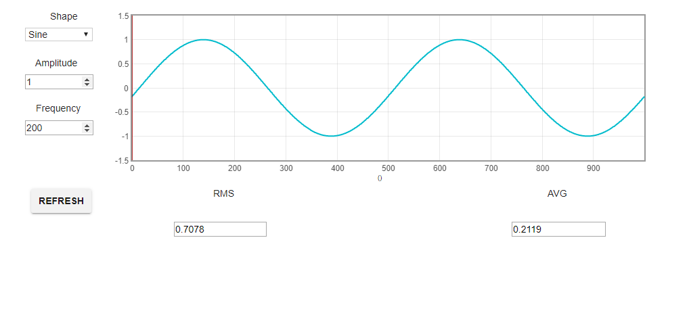

# ti-rtos-generator

## Description

Signal generator implemented on Texas Instrument TMS320C2000 with a F28377S microprocessor using TI RTOS. 
GUI interface created with GUI Composer.

Input:

1. Waveform (sine, rectangle, triangle)
2. Amplitude
3. Frequency

Output:

1. Waveform Graph
2. Average
3. RMS

## GUI

## Installation

* Code Composer Studio v10.1.0
* SYS/BIOS v6.83.00.18
* XDCtools 3.61.02.27
